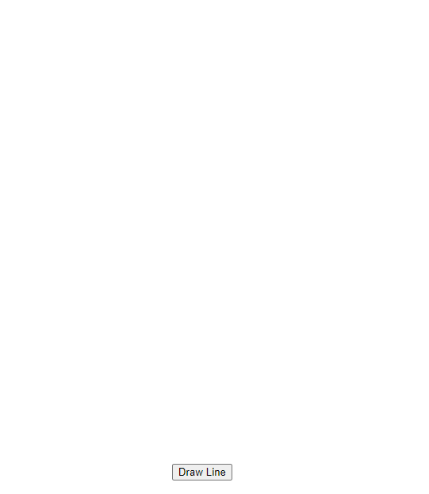
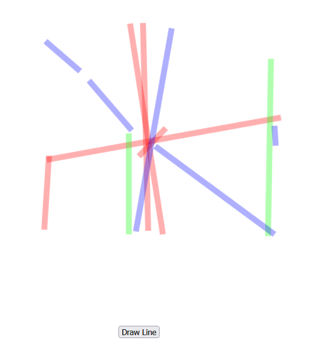
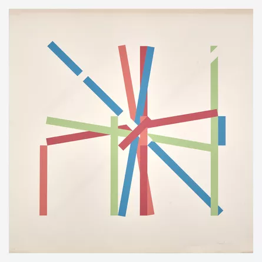

### App Showcase

### Before / After
| Before  | After |
| ------------- | ------------- |
|   |   |

### Target Image

### The process

- In the project directory, run `npm start`
- Navigate to [http://localhost:3000](http://localhost:3000)
- Let the Page Load
- Click on the "Draw Line" button
- Watch the art happen

